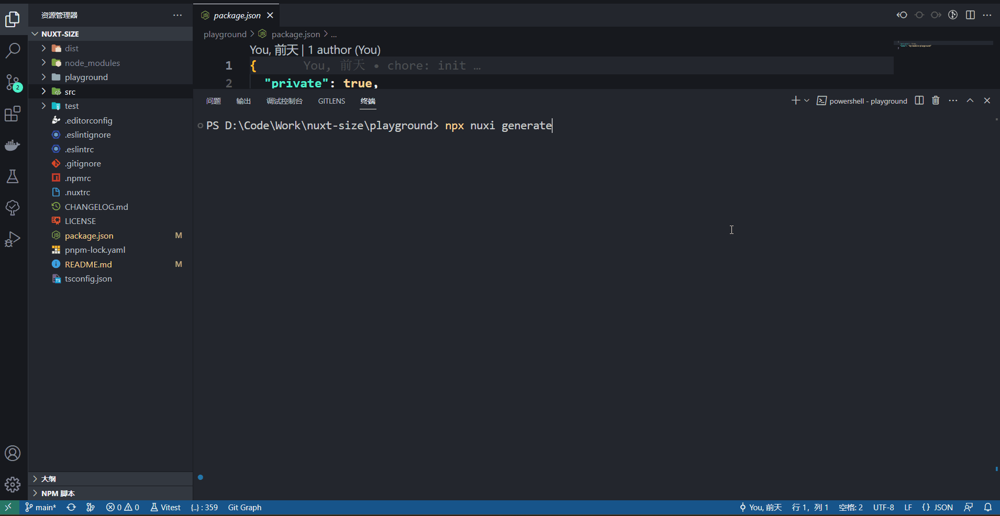

# nuxt-size

ultrafast get folder size after build

<br />

## Features

- ultrafast，power by
  [go-get-folder-size](https://github.com/markthree/go-get-folder-size)

<br />

## Usage

### install

```shell
npm i nuxt-size -D
```

### setup

```ts
// nuxt.config.ts

export default defineNuxtConfig({
  modules: ["nuxt-size"],
});
```

### result

```shell
npx nuxi build
```

or

```shell
npx nuxi generate
```

The console will output the finally size

```shell
Σ Output size: {your size} - D:/Code/Work/nuxt-size/playground/.output
```



<br />

## License

Made with [markthree](https://github.com/markthree)

Published under [MIT License](./LICENSE).
